# Kalendář

(c) 2025, 2026 texty i foto: Josef Pelikán

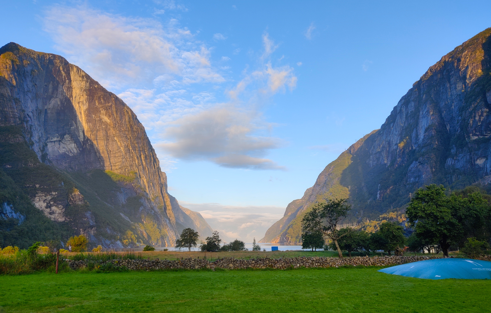

## 00. titulní stránka - Lysebotn

Foceno 11. 8. 2025 v kempu v Lysebotn. Den předtím jsem dorazil autem po silnici 4224 (Lysevegen) se slavnými serpentinami a dokonce jednou otočkou uprostřed kopce (Lysetunnelen), ve které cesta klesne na 1103 metrech o cca 100 metrů. Bylo bohužel dost špatné počasí, fotit nemělo moc smysl.

Na ráno jsem si naplánoval výlet lodí, a když jsem vyšel před sedmou hodinou ven, příroda nám připravila skvělé počasí! Aspoň tedy na tu chvilku, kdy jsme si zahráli na japonské turisty a fotili na všechny objektivy, co byly po ruce...

Později cestou lodí do Flørli už tak pěkně nebylo. Ve Flørli jsem se šel podívat asi sto schodů nahoru, ale pak se vrátil, protože se počasí horšilo a začínalo mrholit (další důvod, proč to nevylézt celé - prvním důvodem byl nedostatek času). Dřevěné schody Flørlitrappene (4444 schodů, prý nejdelší dřevěné schodiště světa) se smí chodit jen nahoru, kvůli bezpečnosti. Byl by to výlet cca na půl dne, dám si ho někdy příště...

<https://www.visitnorway.com/places-to-go/fjord-norway/the-stavanger-region/listings-stavanger/lysevegen-road-in-lysebotn/235453/>

<https://www.florli.no/>

<https://www.visitnorway.com/listings/hike-to-fl%C3%B8rlitrappene-and-rallarstien-in-the-lysefjord/238296/>

---

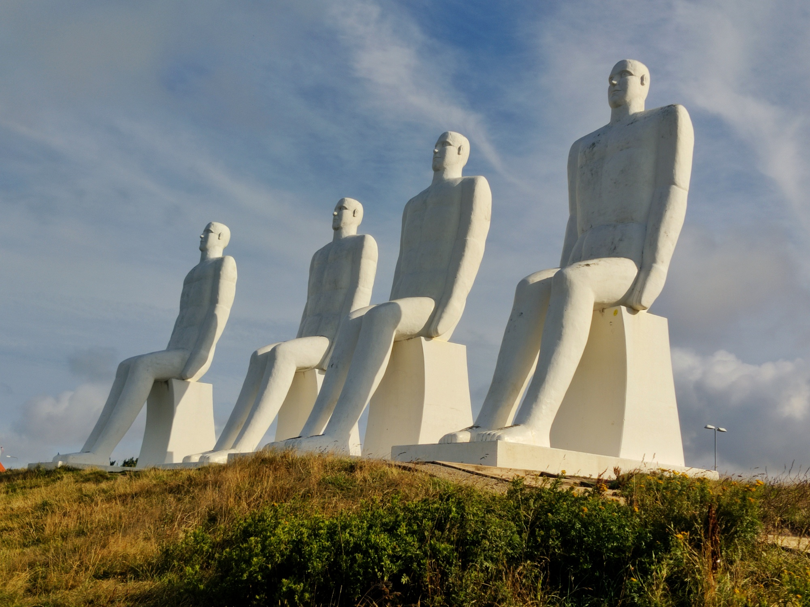

## DK Týden 01: Esbjerg, Men at Sea

Esbjerg je město, které jsem v minulé výpravě vynechal, tentokrát jsem si tam naplánoval nocleh v autě v přístavu a návštěvu blízkého ostrova Fanø. Díky inspiraci od Jana Buriana, cestovatele, písničkáře, básníka a spisovatele, jsem navštívil i toto známé sousoší. Je obtížné ho za pěkného počasí vyfotografovat
bez turistů.

<https://nl.wikipedia.org/wiki/Mannen_aan_de_Zee>

---

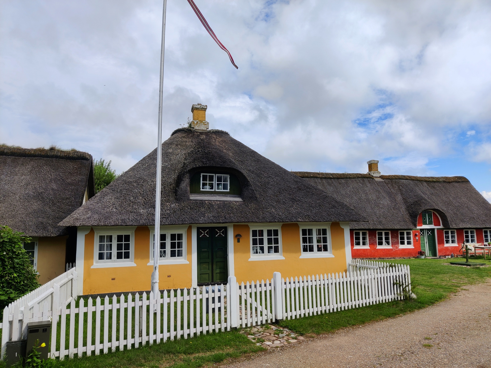

## DK Týden 02: Sønderho

Inspirován opět Janem Burianem jsem tentokrát zajel trajektem i na ostrov Fanø a tam navštívil vesnici Sønderho, prý nejkrásnější v Dánsku.
Mně se rozhodně líbila, i do řeči s jedním místním pánem jsem se dal. Jako kluka ho tam rodiče vozili každé prázdniny a nechávali u babičky a dědy. Celé týdny tam prý v létě neprší.
Když vyrostl, domek po prarodičích nezdědil, ale pořídil si jiný a rodinnou tradici hodlá prodloužit aspoň o generaci.
Pozn: to není ani jeden z domů na fotografii, ten jeho byl trochu méně fotogenický...

<https://www.vadehavskysten.com/ribe-esbjerg-fano/ribe-esbjerg-fano/sonderho-fano-denmarks-most-beautiful-village-gdk1010408>

---

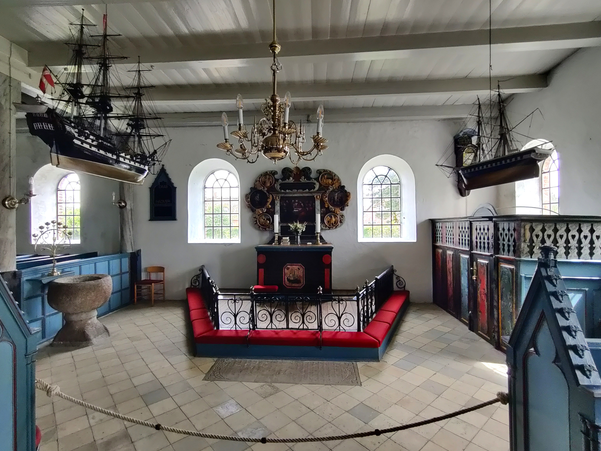

## DK Týden 03: Sønderho Kirke

Na ostrově Fanø jsem došel až k tomuto kostelu, který se ukázal velmi zajímavým - je v něm umístěna nejrozsáhlejší sbírka votivních modelů lodí - je jich tam patnáct!
Varhany z roku 2006 jsou umístěny v přízemí, tak si je můžete dobře prohlédnout. Jejich zvuk jsem ale neslyšel...

<https://de.wikipedia.org/wiki/S%C3%B8nderho_Kirke>

<https://en.wikipedia.org/wiki/Votive_ship>

---

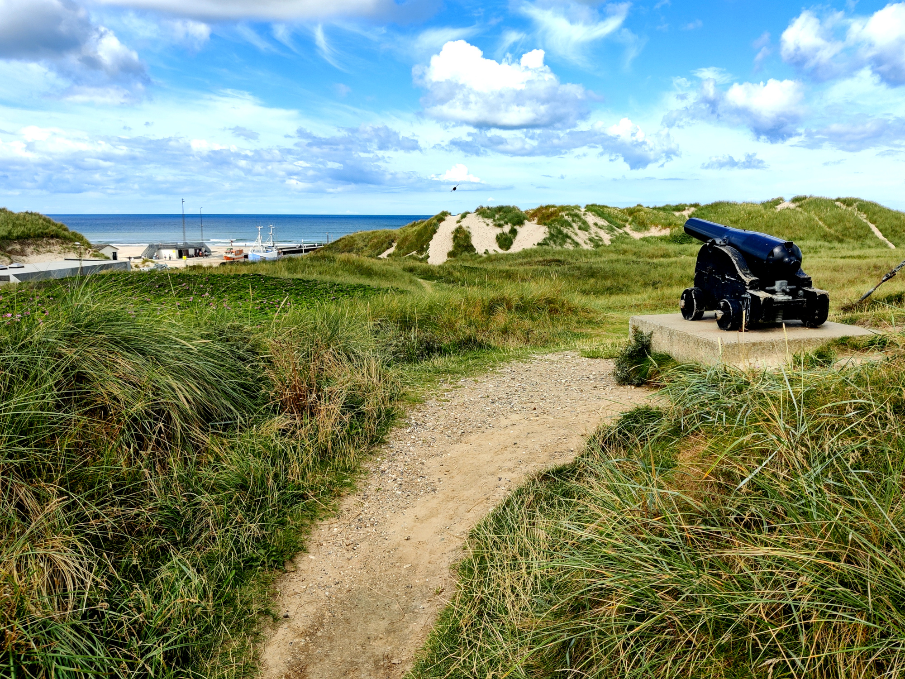

## DK Týden 04: Løkken

Původně rybářské městečko s krásnými plážemi, bunkry a dunami. Minule jsem ho nenavštívil, tak jsem se tam tentokrát zastavil na cestě z Thorup Strand do Aalborgu. To je opravdu krátká cesta, takže jsem mohl v Løkken strávit několik hodin. Procházel jsem se hlavně poblíž moře, protože to mám nejradši. Došel jsem od Sømærket (navigační věž) až k Løkken vandtårn (vodárenská věž). Fotografie je pořízená poblíž Faresignalstationen (stanice pro signalizaci nebezpečí).

Zajímavý zážitek z přístavu popíšu za týden.

<https://en.wikipedia.org/wiki/L%C3%B8kken,_Denmark>

<https://xn--lkkenkunststi-bnb.dk/en/the-9-landmarks/the-sea-mark/>

<https://xn--lkkenkunststi-bnb.dk/en/the-9-landmarks/the-danger-signal-station/>

---

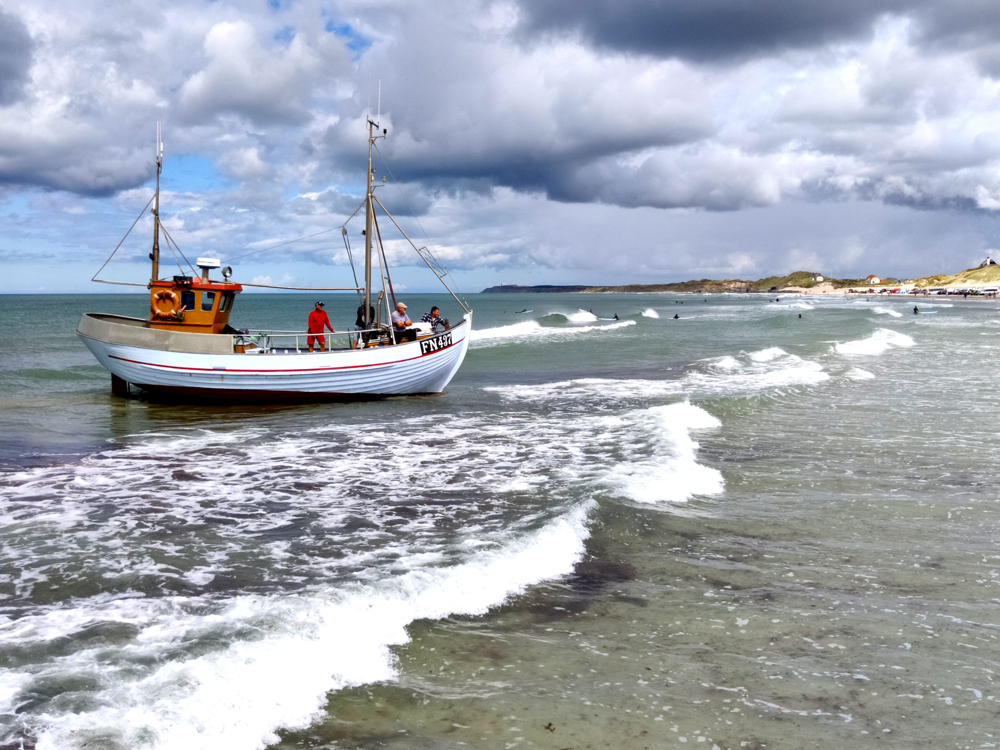

## DK Týden 05: Boat winching, Løkken Mole

Když najdete na letecké mapě Løkken Mole, všimněte si i lodí vytažených ne břeh. Jednoho takového vytahování jsem byl svědkem. Podle množství okukujících lidí - turistů i místních - to je jen občasná podívaná.

Loď FN437 Bihama nejdřív přijela k molu (na severovýchodní straně, která je trochu chráněná proti vlnám) a čekala na asistenci z pevniny. Po molu přijel traktor, přitáhl z navíjecí stanice lano a společně s posádkou na něj loď přivázali. Pak už bylo vše v rukou obsluhy navijáku (domeček na břehu v prodloužení mola, kdybyste se stále dívali na leteckou mapu) a jednoho pomocníka, který měl na starost lano - přehazoval ho podle potřeby na různé kladky (se svislou osou otáčení) umístěné napevno na pláži. Pomalu dotáhli loď až na břeh, zjevně je konstruovaná tak, aby jí tažení po písku nepoškodilo. Celá akce trvala minimálně 20 minut.

<https://www.google.com/search?q=Boat+Winching+in+L%C3%B8kken>

---

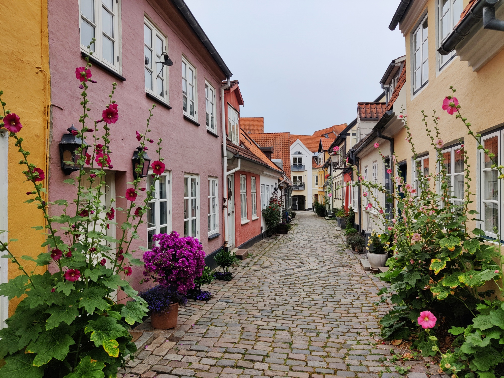

## DK Týden 06: Hjelmerstald, Aalborg

Na radu kamarádky Denisy jsem v Aalborgu navštívil Salling Rooftop (odtud se fotka do kalendáře nedostala) a hned kousek vedle známou historickou uličku Hjelmerstald. Bývá tu hodně turistů, ale já jsem měl štěstí a procházel se tam skoro sám. Skutečně tu bydlí lidé a sem tam tu objevíte krámek se starožitnostmi nebo bleší trh. Jméno uličky je odvozeno od faktu, že tu bývaly koňské stáje.

<https://www.enjoynordjylland.com/north-jutland/plan-your-trip/hjelmerstald-gdk798729>

<https://da.wikipedia.org/wiki/Hjelmerstald>

<https://aalborg-miniby.dk/hjelmerstald>

---

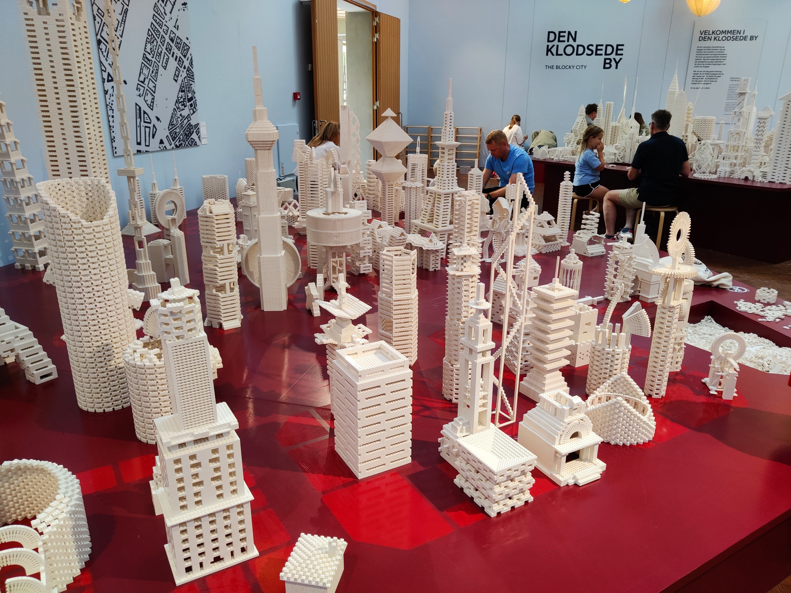

## DK Týden 07: Den klodsede by, Utzon Center, Aalborg

V Aalborgu jsem navštívil skvělé Utzon Center, ale nedávám sem žádnou obvyklou fotku střechy s válcovými plochami. Místo toho je tu zobrazen prostor, tak typický pro Dánsko -
dílna pro Lego a Minecraft. Děti i dospělí si zde mohou sednout, nechat se inspirovat již vystavenými objekty, hrábnout do hromady kostiček a začít tvořit (já jsem odolal, tušil jsem, že bych tam strávil příliš mnoho času, který jsem neměl).

Jørn Utzon spolu se synem Kimem centrum postavili v roce 2008 a věnovali ho architektuře a designu. Dodnes funguje jako pracovní místo pro ateliér Utzon, dokonce jsem někde našel výzvu, že se můžete potichu podívat i přímo do "kanceláří" architektů a designérů, když se předtím dovolíte. To jsem udělal, fotky soukromějších prostor samozřejmě vystavovat nemohu.

Asi nejznámější instalace ateliéru je opera v Sydney, je jí věnována jedna celá místnost, tam se můžete dozvědět mnoho detailů z práce na projektu opery. V Sydney je zase koncertní místnost "Utzon Room".

Centrum má i svou restauraci, která se jmenuje Jørn.

<https://utzoncenter.dk/den-klodsede-lego-minecraft-og-virtual-reality-104>

<https://utzoncenter.dk/en>

---

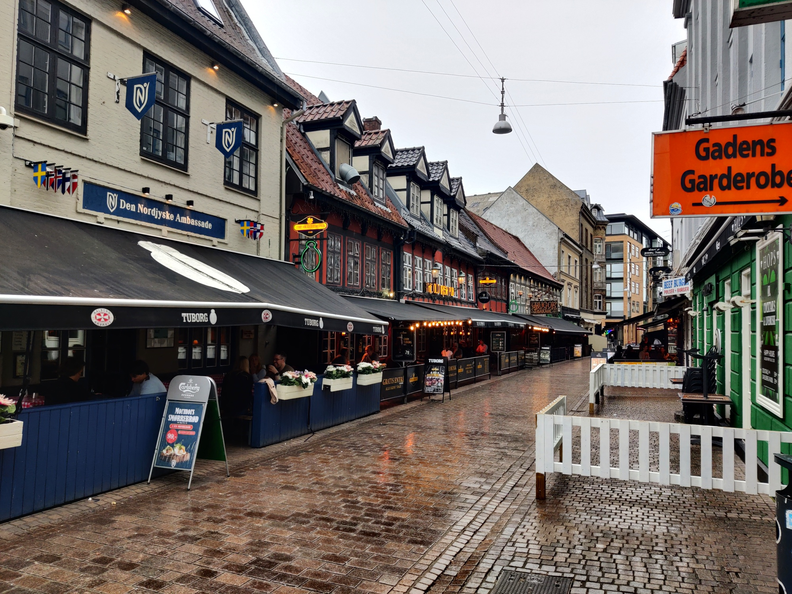

## DK Týden 08: Jomfru Ane Gade, Aalborg

V Aalborgu jsem přespával v malém hotelu v ulici "Panny Anny" a byl jsem skutečně v centru dění. Ubytování nebylo drahé a já až na místě pochopil příčinu - ulička žije bohatým nočním životem, bez špuntů do uší se tu moc nevyspíte. Není neobvyklé, že ve tři hodiny ráno si maník na ulici přinese bednu Marshall, připojí elektrickou kytaru a hraje tak nahlas, aby to nikomu v ulici neušlo.

Dvě noci jsem tu přečkal a večer mohl nasávat atmosféru této legendární uličky. Pokud hledáte jídlo nebo pití, zde najdete snad všechny světové kuchyně a barové styly.

<https://en.wikipedia.org/wiki/Jomfru_Ane_Gade>

<https://www.tv2nord.dk/aalborg/sadan-bliver-j-dag-i-gaden>

---

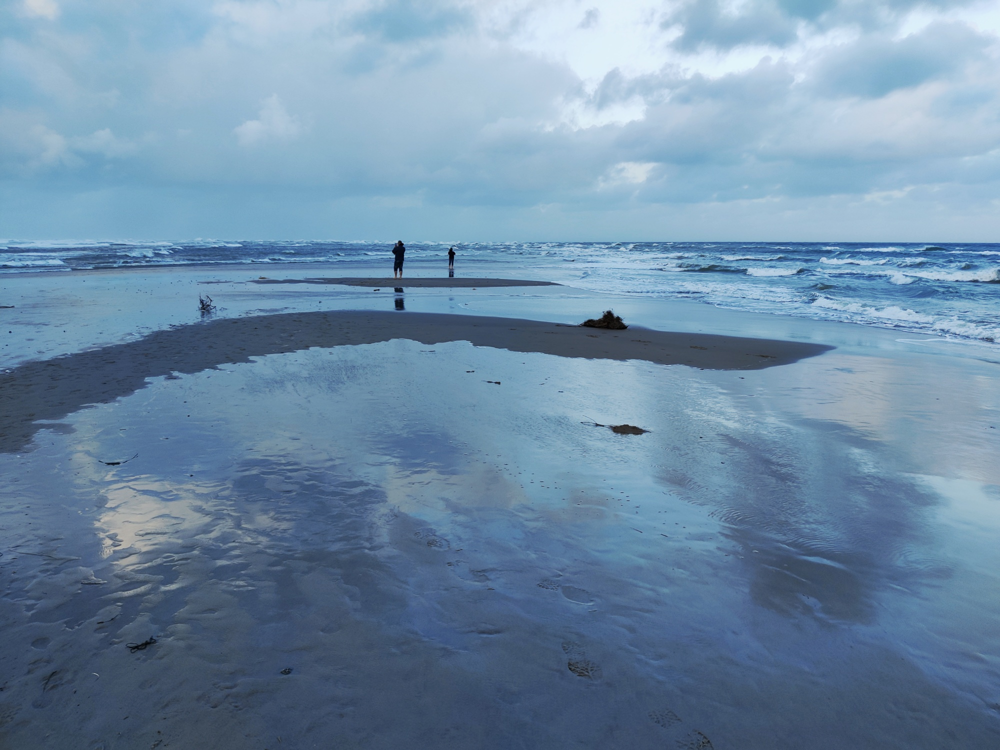
## DK Týden 09: Skagen Odde

Toto geograficky zajímavé místo jsem při minulé návštěvě Dánska vynechal, tak jsem to musel napravit: stýkají se tu Severní moře (průliv Skagerrak) a Baltské moře (průliv Kattegat). Obě moře mají různou teplotu, salinitu a hustotu a na mysu Grenen je občas vidět jejich rozdílná barva  - tu na mé fotce nevidíte. Skoro vždy však můžete pozorovat dva příboje, jak do sebe zuřivě naráží - Skagerrak ze severu a Kattegat z jihovýchodu. Vlastní mys se díky sedimentům posunuje přibližně o šest metrů každým rokem a postupně tak zužuje průliv Kattegat. Je to jedno z míst, kde fotografie nedokáže plně zachytit atmosféru - sílu živlů, barvy moří, hluk příboje. Vlny do sebe narážejí s takovou zuřivostí, jakoby věděly, že v příštích sekundách se jejich energie eliminuje, a tak se aspoň naposledy předvedou.

Z fotografie je vidět, že nebylo ideální počasí, poprchávalo a byl silný vítr. Na konci cesty se mraky aspoň trošku protrhly, to byla dostatečná odměna za 1500m dlouhou procházku pískem, mokré boty i nohavice.

Okolí mysu obývá významná kolonie tuleňů a mnoho druhů ptáků.

Pár kilometrů podél Kattegat se nachází druhý nejvyšší dánský maják Skagen Fyr, pod kterým se dá pěkně vyspat v autě. Odtud mám jen méně kvalitní noční fotky a videa, sem se nedostaly.

<https://en.wikipedia.org/wiki/Grenen>

<https://www.embark.org/denmark/activity-type/adventures/grenen-skagen>

<https://www.enjoynordjylland.com/north-jutland/plan-your-trip/grenen-skagen-gdk640520>

<https://detgraafyr.dk/english>

---

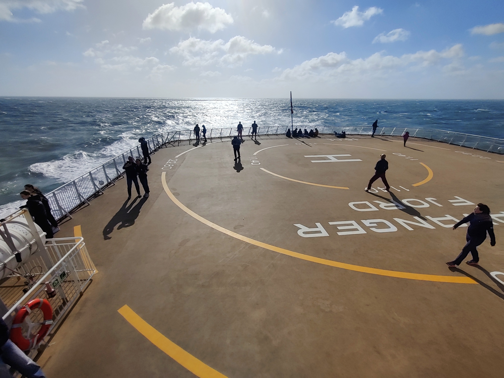
## DK Týden 10: Trajekt do NO

Z dánského přístavu Hirsthals jsem se plavil trajektem do norského Kristiansandu. Jeli jsme lodí MS Stavangerfjord a už před vyplutím to maličko zavánělo dobrodružstvím - kvůli předpovědi počasí v Skagerraku bylo vyplutí posunuto na dřívější hodinu, počasí se mělo postupně zhoršovat a později už by to mohlo být méně bezpečné či méně pohodlné. To jsem přivítal, protože jsem si přál zjistit, jak to mám s mořskou nemocí. Teď už mám jasno...

Veliká loď ovšem skýtá dostatek komfortu a jen velké vlny ji mohou rozhoupat tak, že se voda převaluje přes příď na šesté palubě z deseti. To nám bylo dopřáno zažít. Fotky z toho nemám, protože se přes okna moc fotit nedalo. Místo toho sem dávám fotografii ze zádi, když byly vlny ještě mírnější a spousta pasažérů si spolu se mnou šla užívat větru a sluníčka. Houpání paluby není na fotce vidět, ale bylo zřetelné, jako suchozemec jsem si musel zvyknout na úplně jiný styl chůze. Špatně od žaludku mi však nebylo...

<https://fjordline.com/en/p/our-ships/ms-stavangerfjord/about-the-ship>

<https://en.wikipedia.org/wiki/MS_Stavangerfjord_(2012)>

---

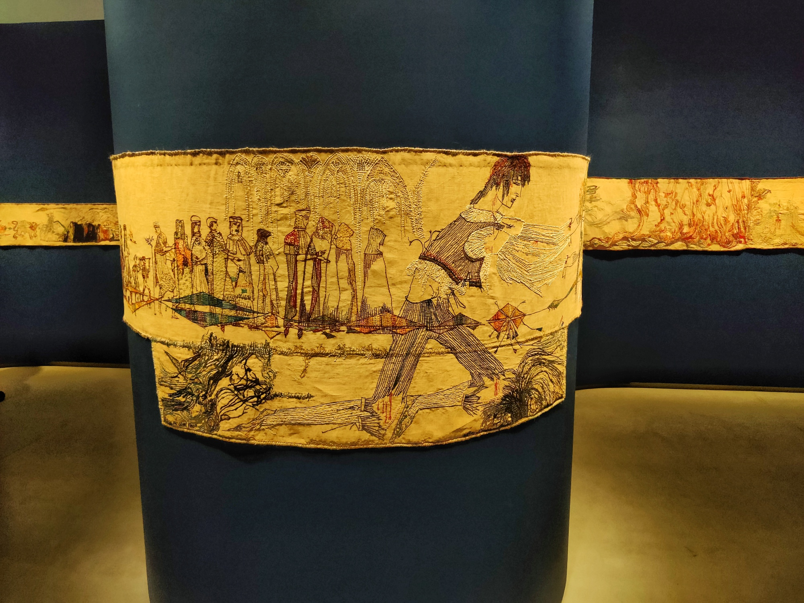
## NO Týden 11: Draumkvedet by Torvald Moseid (Kunstsilo)

Padesét pět metrů dlouhé vyšívané dílo, na kterém pracoval Torvald Moseid čtrnáct let a byl to jeho poslední monumentální počin. Zvolil jsem ho jako reprezentativní (a velice zajímavý) umělecký objekt umístěný ve slavném Kunstsilu.

Jak jsem se do Kunstsila dostal? Na podzim roku 2024 jsem s velkým zájmem sledoval video Adama Gebriana (agebrian) o fascinujícím přerodu průmyslové stavby na muzeum. Do paměti se mi ale nezapsalo jméno norského města (Kristiansand).

Když jsem loni v létě přijížděl trajektem do přístavu v Kristiansandu, zpozoroval jsem už z lodi tuto bílou dominantu. Ihned jsem se rozhodl prodloužit si tam ubytování a jeden den navíc strávit na ostrově Odderøya. Architektonicky zajímavé a nádherné umělecké centrum Kilden bylo bohužel uzavřené (nechávám si ho na příště), ale Kunstsilo jsem si užil maximálně. Když si zaplatíte vstupné, můžete projít všechna patra s uměním. Velmi dlouhá výšivka nebyla jedinou zajímavostí. Jinou instalaci považuji za nejlepší zážitek v Kunstsilu, nešlo ji však fotografovat, napíšu vám o ní příště.

Zatím si můžete pustit skvělé video Adama Gebriana, musím vás však varovat - získáte pravděpodobně neodolatelnou touhu toto norské město navštívit.

<https://www.youtube.com/watch?v=XWMtkU8ffFU>

<https://www.kunstsilo.no/en/exhibitions/draumkvedet>

<https://www.instagram.com/p/DUblJvaCGlQ/>

<https://no.wikipedia.org/wiki/Torvald_Moseid>

<https://www.kunstsilo.no/en>

<https://www.theguardian.com/artanddesign/article/2024/may/16/kunstsilo-grain-silo-gallery-kristiansand-norway-trillion-dollar-man>

---

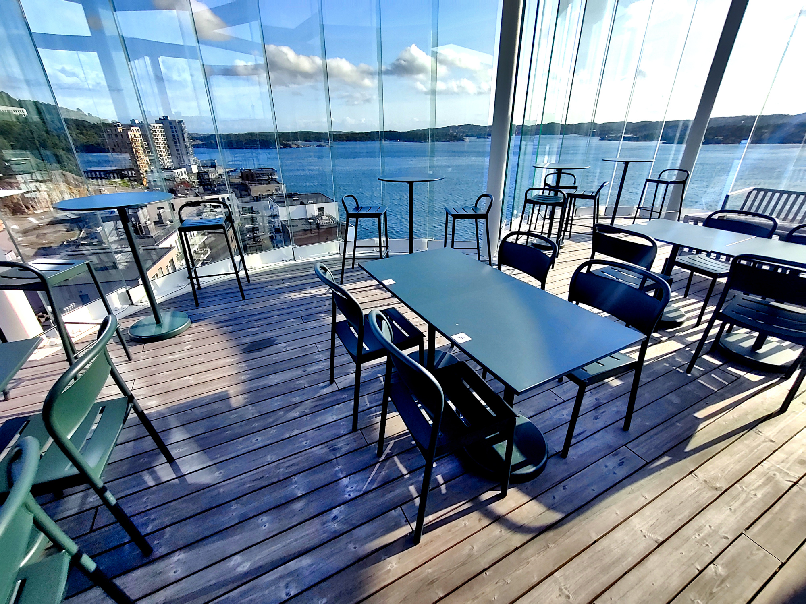
## NO Týden 12: Brasserie, Kunstsilo

Ještě jeden týden se budu věnovat Kunstsilu v Kristiansandu. Nahoře nad původní stavbou sila byla vybudována prosvětlená "Brasseri", kde si můžete dát kávu nebo oběd. Pokud máte pěkné počasí (jako já), budete se pravděpodobně chtít posadit do prosklených výklenků, odkud je z výšky 38 metrů vidět na velkou část ostrova Odderøya nebo na přístav a hlavní čtvrti města. Je tam příjemně čerstvý vzduch, protože jednotlivé skleněné pruhy mají mezi sebou mezery. Celkový dojem připomíná vrchol majákové věže, místo, ze kterého proudí světlo.

Z minulého týdne jsem si nechal popis umělecké instalace, která mne velmi překvapila, a možná i proto ohromně zaujala: "VOX by Jónsi". Jestli znáte islandskou hudební skupinu Sigur Rós, tak budete znát i jméno Jónsi. Jón Þór "Jónsi" Birgisson vytvořil audiovizuální instalaci, ve které hraje hlavní roli jeho hlas, reprodukovaný z padesáti reproduktorů kolem místnosti. Váš zážitek je zesílen optickými vjemy, které jsou docela prosté - až minimalistické - svým designem, ale silné účinkem: působivé barvy zobrazované na vodorovných pásech ze všech stran místnosti. Pokud posloucháte sami - nebo skoro sami - máte velmi hluboký prožitek: temná místnost, občasné světlo, barvy kolem vás, Jónsiho hlas všude kolem vás.

Slovy to nedokážu dobře popsat, zkuste si pustit nějaké krátké video uvedené dole. Nebo pátrejte po tom, kde je instalace VOX v současnosti v provozu, v Kristiansandu už to není.

<https://www.kunstsilo.no/en/visit-us/brasserie>

<https://www.dezeen.com/2024/05/09/kunstsilo-museum-grain-silo-norway/>

<https://en.wikipedia.org/wiki/Odder%C3%B8ya>

<https://martynwhite.co.uk/art/jnsis-vox-at-kunstsilo-where-voice-becomes-light-sound-and-spirit>

<https://www.kunstsilo.no/en/exhibitions/vox-av-jonsi>

<https://www.kunstsilo.no/en/channel/interview-w-jonsi>

<https://www.kunstsilo.no/no/kunstsilo-live/utstillingsapning-vox-av-jonsi>

<https://www.youtube.com/watch?v=yPVdDxYTZyQ>

<https://vimeo.com/885991712>

---

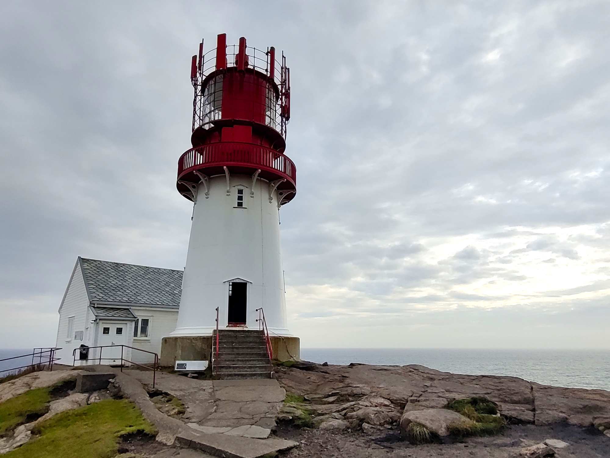

## NO Týden 13: Lindesnes fyr

První den opravdového auto-výletu po Norsku jsem věnoval jižnímu pobřeží. Navštívil jsem známou pláž Kanelstranda, tu však musíte vidět kolem západu slunce za pěkného počasí, abyste ulovili legendární snímky (a to nebyl můj případ).

Další zastávkou byl velice známý maják "Lindesnes fyr" se zajímavou historií i technickým dědictvím. Bez zaplacení vstupného se nedostanete ani k majáku, tak jsem zaplatil. Vyplatilo se to, v ceně byl i přístup ke zbytkům WWII opevnění a vstup do pěkného muzea. Původní zdroje světa, historické Fresnelovy čočky, to jsou příklady exponátů.

Na noc jsem odjel na první mé "divoké" norské parkoviště u jezera Botnevatnet na silnici Kvanvikveien. Bylo tak plno, že jsem tam skoro nezaparkoval, ale nakonec se v autě vyspal slušně, pravděpodobně díky únavě.

<https://www.visitnorway.com/listings/kanelstranda-cinnamon-beach/17598/>

<https://en.wikipedia.org/wiki/Lindesnes_Lighthouse>

---

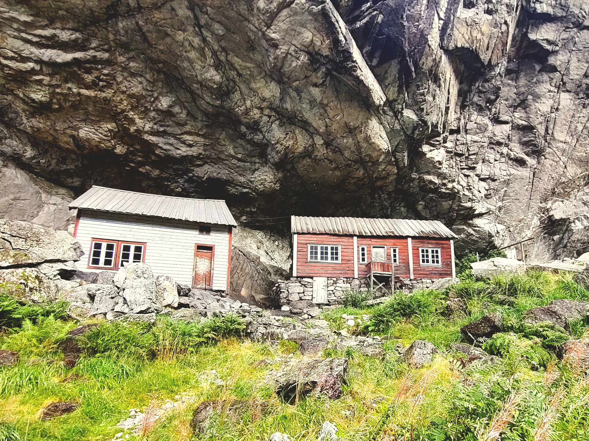

## NO Týden 14: Helleren, Jøssingfjord

Další den jsem brzo ráno vyrazil do Jøssingfjordu za jednou z nejslavnějších atrakcí - národní památkou Helleren. Dva domky byly postaveny pod skalním převisem hlubokým přibližně deset metrů, který je částečně chrání před deštěm a sněhem. Zřejmě již od sedmnáctého století bylo možné toto místo celoročně obývat - viz odkazy níže.

Opodál je postavená zajímavá moderní stavba: vědecké muzeum Jøssingfjordu. Byl jsem na místě příliš brzo a nechtělo se mi čekat na otevírací hodinu (11:00), tak jsem návštěvu muzea vynechal. Podle toho, co se dá přečíst na webu nebo informačních tabulích, ta návštěva by stála za to.

Místo toho jsem se zastavil na vrcholu skály nad převisem, je tam parkoviště, pěkný výhled a přístup k historickému památníku postavenému na počest norských hrdinů, kteří vzdorovali nacistické okupaci.

<https://dalanefolkemuseum.no/avdelinger/helleren/>

<https://dalanefolkemuseum.no/avdelinger/jossingfjord-vitenmuseum/>

<https://www.visitnorway.com/listings/helleren-and-jossingfjord/25192/>

<https://en.wikipedia.org/wiki/J%C3%B8ssingfjord>

---

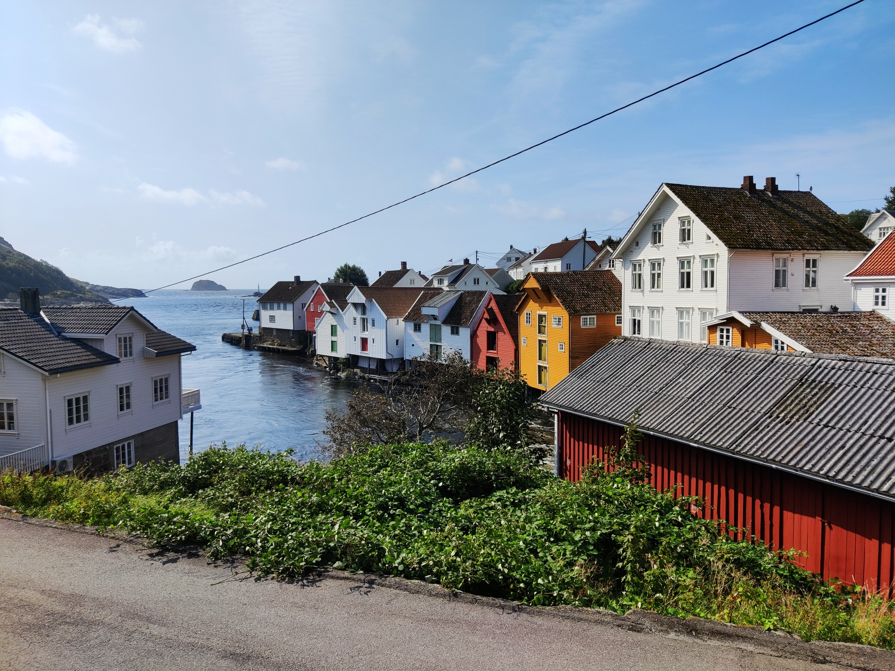

## NO Týden 15: Sogndalstrand

Přístavní vesnice Sogndalstrand (Sogndalsstranda) byla postavena kolem ústí řeky Sokno do Severního moře. Dodnes jsou tam zachovány malebné domy na nábřeží, dříve sloužily často jako sklady dovezeného zboží. Z druhé strany těchto domů prochází ulice Strandgaten - pokud půjdete na její jižní konec a pak vystoupáte do výšky, dostanete se až k vyhlídce na moře (Loshytto).

Na druhém břehu řeky můžete dojít až do přístavu, který se dnes už neužívá k dovozu zboží.

<https://en.wikipedia.org/wiki/Sogndalstrand>

<https://www.visitnorway.com/listings/sogndalstrand/25196/>

<https://www.fjordnorway.com/en/attractions/sogndalstrand>

<https://magmageopark.no/en/location-object/sogndalstrand/>

---

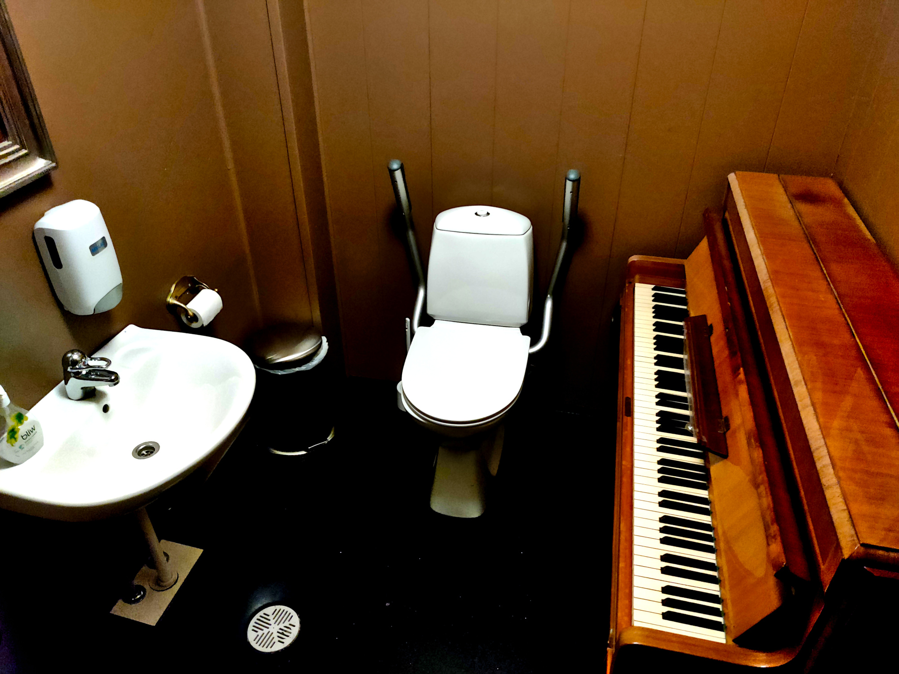

## NO Týden 16: Sogndalstrand Kulturhotell

Významnou budovou na Strandgaten (Sogndalstrand) je Kulturhotell; zaujal mne už zvenku, tak jsem se rozhodl dát si tam kávu. Pěkné prostředí jejich jídelny jsem sice vyfotil, ale nakonec je nejlepším snímkem tato toaleta s funkčním piánem - a bylo docela dobře naladěné, pokud mohu posoudit.

<https://sogndalstrand-kulturhotell.no/en/home/>

<https://www.visitnorway.com/listings//sogndalstrand-kulturhotell/25108/>

---

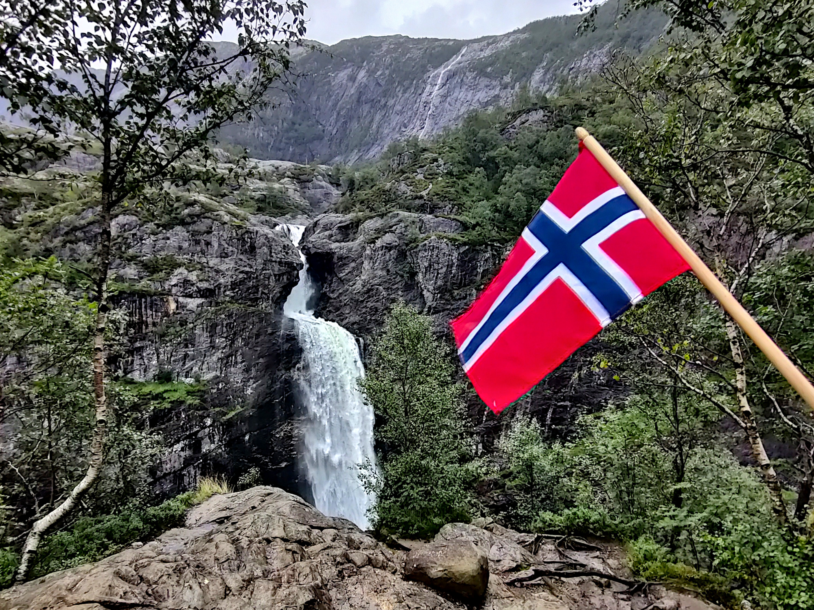

## NO Týden 17: Månafossen

Byla to moje vlajka? Nebyla. Musel jsem kvůli vyhlídce na vodopád lézt po skále? Musel (viz YT video v odkazech).

Z parkoviště je cesta asi 100 výškových metrů nahoru k vyhlídce. Naštěstí je cesta dobře připravená, snad jen za vlhka by byla nebezpečná.
Nicméně klasifikace obtížnosti norských pěších tras je asi trochu jiná, tohle bylo myslím označeno jako "lehké". Rozhodně nedoporučuji se nahoru vydat bez dobrých pevných bot.

Nahoru a dolů proudily skupinky turistů, na místě byl však klid a mohli jste si najít místo jen pro sebe. Já se tam seznámil s norskou rodinou, rodiče a dvě menší děti. Napadla mne otázka o cestování po rodné zemi: "Jak často se vydáte k nějaké turistické atrakci (skála, výhled, vodopád), když se nachází ve vaší zemi?" Norové mi odpověděli, že u tohoto vodopádu jsou poprvé v životě a že v posledních letech cestují víc, protože děti toho už jsou schopny (úplná klasika, tak to má IMO i většina našich rodin). Smalltalk nemá cenu sdílet, ale musím jim ještě jednou poděkovat za půjčení vlaječky, kterou se mi podařilo docela dobře použít v mé fotografii (viz "hloubka ostrosti").

Cesta dolů byla nepřekvapivě náročnější, i proto, že začalo drobně mžít.

Pokud budete někdy v okolí Stavangeru, rozhodně doporučuji!

<https://en.wikipedia.org/wiki/M%C3%A5nafossen>

<https://www.visitnorway.com/listings/manafossen-waterfall-and-friluftsgarden-man/39557/>

<https://www.youtube.com/watch?v=WmBoDCR5hbs>

---

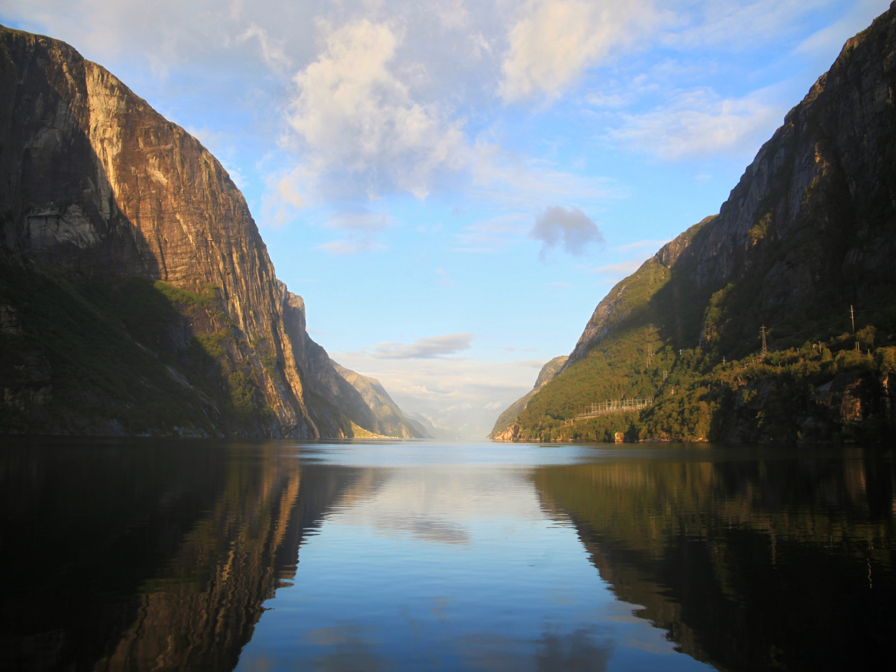

## NO Týden 18: Lysefjord from Lysebotn

Foceno 11. 8. 2025 před sedmou hodinou z kempu v Lysebotn. Den předtím jsem dorazil autem po silnici 4224 (Lysevegen) se slavnými serpentinami a dokonce jednou otočkou uprostřed kopce (Lysetunnelen), ve které cesta klesne na 1103 metrech o cca 100 metrů. Bylo špatné počasí, fotit nemělo moc smysl.

Nahoře nad serpentinami se nachází odpočívadlo a vyhlídka Øygardsstølen, tam jsem se zastavil a dal si kafe. Je jasné, že za krásného počasí tam jsou moc pěkné výhledy, já pár fotek dal už dříve do příspěvku označeného "Kjerag". S obsluhou občerstvení jsem prohodil pár slov, ukázalo se, že provozují také kemp dole v Lysebotn, kam jsem měl namířeno.

Výlet lodí do Flørli (Flørlitrappene) je zdokumentován v jiném příspěvku, viz níže.

<https://www.visitnorway.com/places-to-go/fjord-norway/the-stavanger-region/listings-stavanger/lysevegen-road-in-lysebotn/235453/>

<https://linktr.ee/kjeragcaferestaurant>

[Flørli](https://www.instagram.com/p/DNvAzkXVIuG/)

[Kjerag](https://www.instagram.com/p/DNsSpIkVCMK/)

